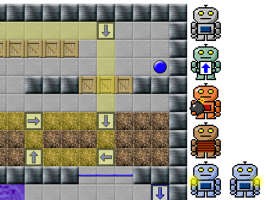

Some friends and I wrote a game called Team Robot for a video game
design class my last year at Georgia Tech. The game wasn't as
ambitious as others in our class, and with 2D sprites drawn in MS
Paint, was among the ugliest...but I was proud that it was a complete
start-to-finish game and that it had a little bit of an inventive
puzzle-solving mechanism.

To me the really cool parts were the levels, 30 of them, designed
almost all by my friend [Tommy](http://bopmtg.net/) on graph
paper. There's a nice, non-repetitive, progression, with some really
diabolical ones at the end. In the original incarnation of the game,
the line of robots march forward unless the game is paused. This means
that the later levels require pod-racer-like two-handed dexterity to
coordinate choosing and launching your bots.

I wanted to reimplement the game in javascript for a handful of
reasons. It seemed like a fun way to get into JS with a premade set of
images and predefined logic. I also had always wanted to experiment
with the controls, to see if the game could be made more. I tried to
make it more mouse-(and ostensibly touch-)friendly by advancing the
train only as far as your most recent mouse-click.

<a href="game.html">Play!</a>

